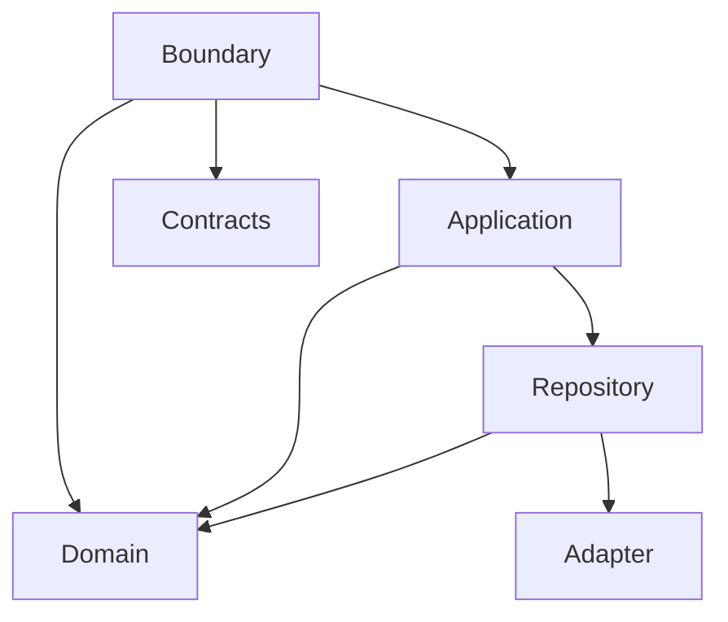
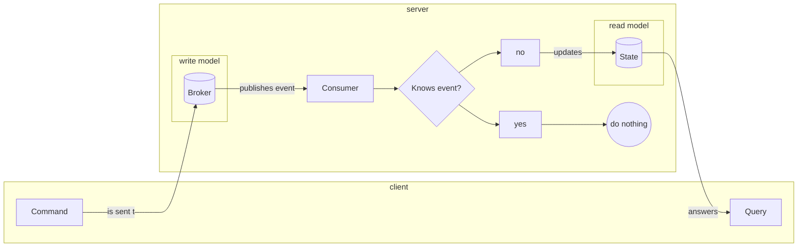

# Domain
- models of objects that are unique to the backend domain
- pure functions around those models
# Boundary
- mapping from contracts to domain models
- http endpoints
# Application
- glue code/orchestration of repositories, consumers
# Repository
- handling of persistence with concrete purpose in regard to domain
# Adapter
- low level handling of external systems, suchs as dbs
# CQRS
