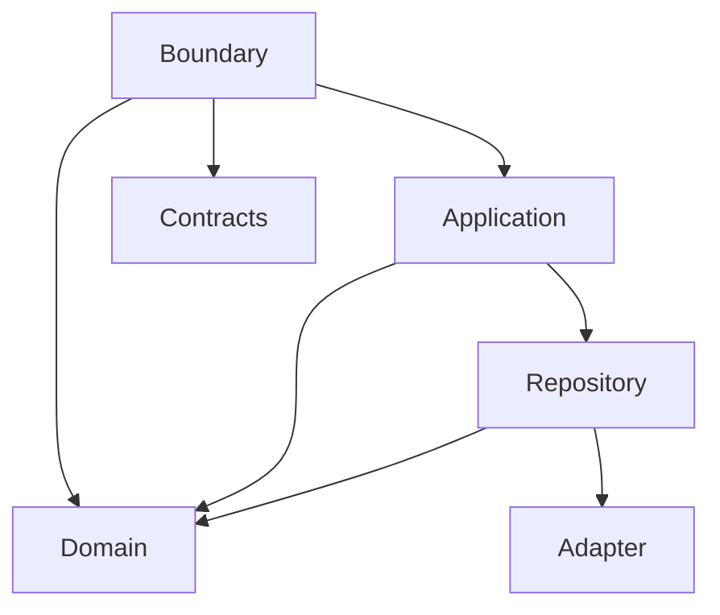
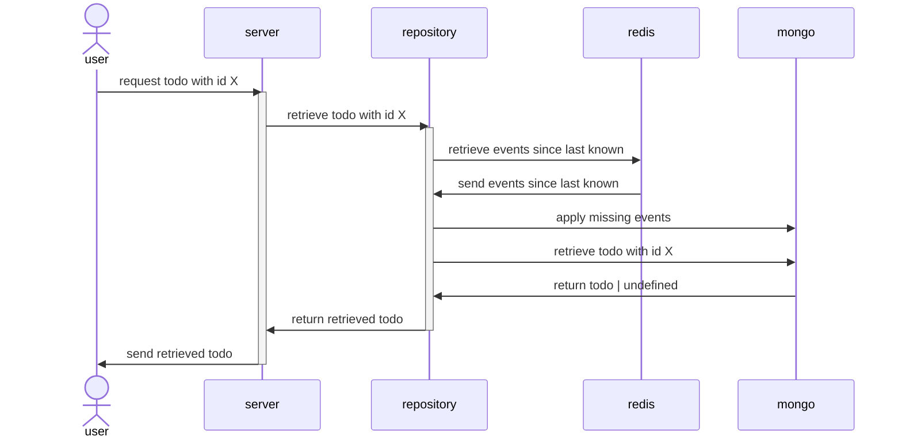

# Boundary
- mapping from contracts to domain models
- http endpoints
# Application
- glue code/orchestration of repositories
# Adapters
- low level handling of external systems
# Fetching a todo

