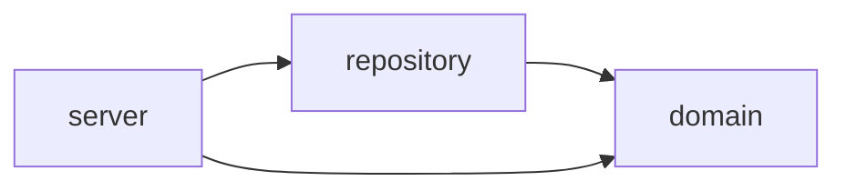
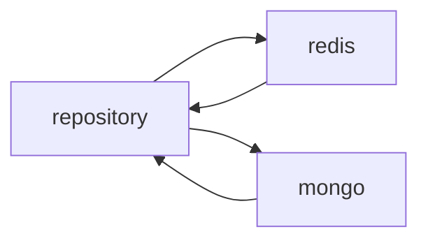
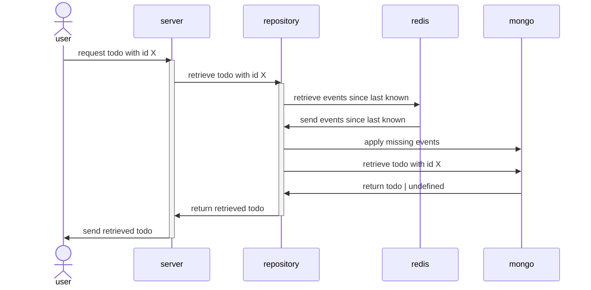

```mermaid
flowchart LR
repository-->domain
server-->domain
server-->repository
```
# Repository

```mermaid
flowchart LR
repository--> redis & mongo -->repository
```
# Fetching a todo

```mermaid
sequenceDiagram
Actor user
user->>server: request todo with id X

activate server

server->>repository: retrieve todo with id X

activate repository
	repository->>redis: retrieve events since last known
	redis->>repository: send events since last known
	repository->>mongo: apply missing events
	repository->>mongo: retrieve todo with id X
	mongo->>repository: return todo | undefined
	repository->>server: return retrieved todo
deactivate repository

server->>user: send retrieved todo

deactivate server
```

