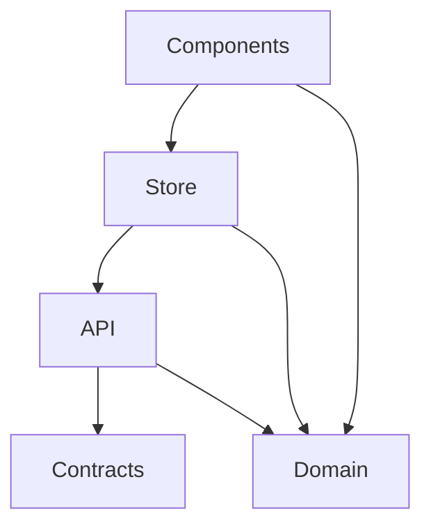

# Application
- interacts with the user
- drives changes through the store
- represents data from the store
- adapter
# Store
- holds the current business state
- interacts with API
# API
- communiation with the backend
- adapter
# Domain
- models of the business data specific to the frontend domain
