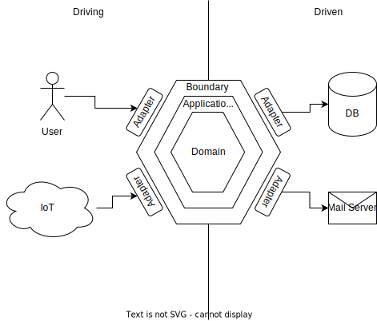
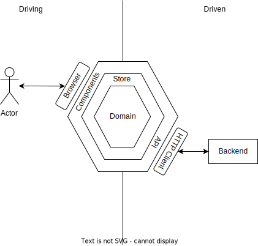

:::div{style='display: none;'}
:define-var[Architectures <3 js]{#title}
:define-var[some witty subtitle]{#subtitle}
:define-var[]{#section}
:::

::::::::::::::::::shell

<header>

::::div{style = "display: flex; width: 100%; justify-content: space-between"}
::var{#title}
::var{#section}
::::

</header>

<footer>


<div class="speaker">
  
  <span>@KatjaPotensky</span>
</div>

</footer>

::::::::::::::::::::::::

:::slide{#greeting.no-shell}

# :var{#title}

### :var{#subtitle}

<!-- this is optional but useful for external events -->
<div class="info">
  
  <div class="speaker">
    
    <h4>@KatjaPotensky</h4>
  </div>
</div>


:::

[//]: <> (PRESENTATION STARTS HERE)
[//]: <> (PRESENTATION STARTS HERE)
[//]: <> (PRESENTATION STARTS HERE)

:::slide{#agenda}

# Agenda

- prelude
  - naming conventions
  - fp intro
- intro
- ports and adapters
- cqrs 
- event sourcing
- lazy loading
- architectural decision records

:::

[//]: <> (START: Code Conventions)

::::::::::::::::::::::::slide

::::slide{.no-shell.bg-black}

<div class="center">

# Naming conventions

</div>

::::

::::slide

# Namespaced imports

```typescript
import * as Rx from "rxjs";
```
```typescript
import * as Domain from "../domain";
```

:::fragment

# Exceptions

```typescript
import { task } from "fp-ts";
```
```typescript
import { pipe } from "fp-ts/lib/function";
```
```typescript
import { ignore } from "utils";
```

:::

::::

::::::::::::::::::::::::

::::::::::::::::::::::::slide

::::slide{.no-shell.bg-black}

<div class="center">

# FP - Intro

</div>

::::

::::slide

# Composition - pipe

```typescript
const getZero = () => 0;

const shoutOne = () => {
  const one = addOne(getZero());
  const stringified = stringify(one);
  const uppercased = uppercase(stringified);
  return uppercased;
}
```
:::fragment

is the same as this:

```typescript
const getZero = () => 0;

const shoutOne = pipe(
  getZero,
  addOne,
  stringify,
  uppercase
);
```

:::

::::

::::slide

# Composition - flow

```typescript
const shoutNext = (getNumber) => {
  const next = addOne(getNumber());
  const stringified = stringify(next);
  const uppercased = uppercase(stringified);
  return uppercased;
}
```

:::fragment

is the same as this:

```typescript
const shoutNext = flow(
  addOne,
  stringify,
  uppercase,
);
```

:::

::::

::::slide

# Functors

```typescript
const shoutNext = (fetchNumber) => fetchNumber()
  .then(addOne)
  .then(stringify)
  .then(uppercase);
```

:::fragment

is equivalent to this:

```typescript
const shoutNext = flow(
  task.map(addOne),
  task.map(stringify),
  task.map(uppercase),
);
```

:::

::::

::::slide

# Chains

```typescript
const shoutNext = (fetchNumber) => fetchNumber()
  // add one and return wrapped in promise
  .then((number) => Promise.resolve(addOne(number)))
  // stringify and return wrapped in promise
  .then((next) => pipe(stringify(next), Promise.resolve))
  // uppercase and return wrapped in promise
  .then(flow(uppercase, Promise.resolve));
```

:::fragment

is equivalent to this:

```typescript
const shoutNext = flow(
  // add one and return wrapped in task
  task.chain((number) => task.of(addOne(number))),
  // stringify and return wrapped in task
  task.chain((next) => pipe(stringify(next), task.of)),
  // uppercase and return wrapped in task
  task.chain(flow(uppercase, task.of)),
);
```

:::

::::

::::slide{.no-shell}

<div class="center">

# Wrap-Up

- go with the _flow_
- monads aren't hard
- fp isn't black magic

</div>

::::

:::::::::::::::::::::::::::::

[//]: <> (END: Code Conventions)

[//]: <> (START: Actual Content)

::::slide{#intro.bg-black.no-shell}

<div class="center">

# What is "Architecture"?

</div>

:::speaker

- decisions that are hard to change
- programming with a plan
- defines structure

:::

::::

:::::::::::::::::::slide{#ports-and-adapters}

::::slide{.no-shell.bg-black}

<div class="center text-center">

# Ports and Adapters / Hexagonal Architecture

</div>

::::

::::slide

# Theory



::::

::::slide

# Frontend



::::

::::slide{.bg-black}

<div class="center">

# Defining Dependencies

1. open `task-01` in your IDE
1. define dependencies via `eslint-plugin-import`
1. try to commit your changes

</div>

::::

:::::::::::::::::::

[//]: <> (PRESENTATION ENDS HERE)
[//]: <> (PRESENTATION ENDS HERE)
[//]: <> (PRESENTATION ENDS HERE)

:::slide{#qna.no-shell}


<h1>Questions & possible Answers</h1>

:::
