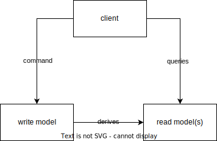

:::div{style='display: none;'}
:define-var[Architectures <3 js]{#title}
:define-var["js is only for fancy animations"]{#subtitle}
:define-var[]{#section}
:::

::::::::::::::::::shell

<header>

::::div{style = "display: flex; width: 100%; justify-content: space-between"}
::var{#title}
::var{#section}
::::

</header>

<footer>


<div class="speaker">
  
  <span>@KatjaPotensky</span>
</div>

</footer>

::::::::::::::::::::::::

:::slide{#greeting.no-shell}

# :var{#title}

### :var{#subtitle}

<!-- this is optional but useful for external events -->
<div class="info">
  
  <div class="speaker">
    
    <h4>@KatjaPotensky</h4>
  </div>
</div>


:::

::::::::slide{#learnings}

::::slide{.no-shell.bg-black}

<div class="center">

# Keep. It. Simple.

### Simple != Easy

</div>

:::speaker

- write code that is easy to read, not easy to write
- the best code is no code
  - libraries are *also* code! Just not under your control
- architecture tries to solve a lot of problems
  ... that probably never occur

:::

::::

::::::::

[//]: <> (PRESENTATION STARTS HERE)
[//]: <> (PRESENTATION STARTS HERE)
[//]: <> (PRESENTATION STARTS HERE)

:::slide{#agenda.no-shell}

<div class="center">

# Agenda

- prelude
  - naming conventions
  - fp intro
  - setup
- intro
- ports and adapters
- cqrs
- architectural decision records
- event sourcing

</div>

:::

[//]: <> (START: Prelude)

::::::::::::::::::::::::slide

::::slide{.no-shell.bg-black}

<div class="center">

# Naming conventions

</div>

::::

::::slide

# Namespaced imports

```typescript
import * as Rx from "rxjs";
```

```typescript
import * as Domain from "../domain";
```

:::fragment

# Exceptions

```typescript
import { task } from "fp-ts";
```

```typescript
import { pipe } from "fp-ts/lib/function";
```

```typescript
import { ignore } from "utils";
```

:::

::::

::::::::::::::::::::::::

::::::::::::::::::::::::slide

::::slide{.no-shell.bg-black}

<div class="center">

# FP - Intro

</div>

::::

::::slide

# Composition - pipe

```typescript
const getZero = () => 0;

const shoutOne = () => {
  const one = addOne(getZero());
  const stringified = stringify(one);
  const uppercased = uppercase(stringified);
  return uppercased;
};
```

:::fragment

is the same as this:

```typescript
const getZero = () => 0;

const shoutOne = pipe(getZero, addOne, stringify, uppercase);
```

:::

::::

::::slide

# Composition - flow

```typescript
const shoutNext = (getNumber) => {
  const next = addOne(getNumber());
  const stringified = stringify(next);
  const uppercased = uppercase(stringified);
  return uppercased;
};
```

:::fragment

is the same as this:

```typescript
const shoutNext = flow(addOne, stringify, uppercase);
```

:::

::::

::::slide

# Functors

```typescript
const shoutNext = (fetchNumber) =>
  fetchNumber().then(addOne).then(stringify).then(uppercase);
```

:::fragment

is equivalent to this:

```typescript
const shoutNext = flow(
  task.map(addOne),
  task.map(stringify),
  task.map(uppercase),
);
```

:::

::::

::::slide

# Chains

```typescript
const shoutNext = (fetchNumber) =>
  fetchNumber()
    // add one and return wrapped in promise
    .then((number) => Promise.resolve(addOne(number)))
    // stringify and return wrapped in promise
    .then((next) => pipe(stringify(next), Promise.resolve))
    // uppercase and return wrapped in promise
    .then(flow(uppercase, Promise.resolve));
```

:::fragment

is equivalent to this:

```typescript
const shoutNext = flow(
  // add one and return wrapped in task
  task.chain((number) => task.of(addOne(number))),
  // stringify and return wrapped in task
  task.chain((next) => pipe(stringify(next), task.of)),
  // uppercase and return wrapped in task
  task.chain(flow(uppercase, task.of)),
);
```

:::

::::

::::slide{.no-shell}

<div class="center">

# Wrap-Up

- go with the _flow_
- monads aren't hard
- fp isn't black magic

</div>

::::

::::slide{.bg-black}

<div class="center">

# Setup

1. `git clone `
1. `npm ci`
1. `npm start`
1. open `localhost:3000`
1. add a few todos

</div>

::::

:::::::::::::::::::::::::::::

[//]: <> (END: Prelude)

[//]: <> (START: Actual Content)
[//]: <> (START: INTRO)

:::::::::::::::::::slide{section = "Intro"}

::::slide{.bg-black.no-shell}

<div class="center">

# What is "Architecture"?

</div>

:::speaker

- defines structure
- adds rules
- decisions that are hard to change

### programming with a plan

:::

::::

::::slide

<div class="center">

</div>

::::

::::slide

# And why?

<div class="center" style="height: initial;">

</div>

:::speaker

### Separate Business Logic from Application Logic

- reduce degrees of freedom
- structure increases order
- make it easier for new participants
- guide questions around structure

:::

::::

:::::::::::::::::::

[//]: <> (END: INTRO)
[//]: <> (START: Ports and Adapters)

:::::::::::::::::::slide{section = "Ports and Adapters"}

::::slide{.no-shell.bg-black}

<div class="center text-center">

# Ports and Adapters / Hexagonal Architecture

</div>

::::

::::slide

# Theory


::::

::::slide

# Example - Frontend


::::

::::slide

# Example - Backend


::::

::::slide{.no-shell}

<div class="center">

# Wrap-Up

- adapter connects to outside
- boundary translates outside to domain
- application orchestrates all the things
- domain models business data and is _pure_

</div>

::::

::::slide

<div class="center">

</div>

::::

::::slide{#task-01.bg-black}

<div class="center">

# Defining Dependencies

1. `cd task-01`
1. define dependencies via `eslint-plugin-import`
1. try to commit your changes

</div>

::::

::::slide{#task-02.bg-black}

<div class="center">

# A wild error appears

1. try to add a new todo
1. open `overview.tsx` (where the lint error occurs)
1. instead of using the api, use the store
1. use todos with

```typescript
const { todos } = Store.Todo.useTodos();
```

</div>

::::

:::::::::::::::::::

[//]: <> (END: Ports and Adapters)
[//]: <> (START: CQRS)

:::::::::::::::::::slide

::::slide{.no-shell.bg-black}

<div class="center">

# CQRS

## Command Query Responsibility Segregation

</div>

::::

::::slide

# Theory



::::

::::slide

# Write Model

<div class="flex justify-center">

</div>

:::speaker

- task oriented, declarative
- only writes data from the command
- is _not_ concerned with any domain other than exactly the command

1. buy clothes
1. technically you have _JUST ONLY_ bought clothes

:::

::::

::::slide

# Read Model(s)


:::speaker

- "do people think you look ridiculous"
- "how much money do you have left"
- "how full is your closet"

### Read Model answers

- what _results_ from a command
- multiple read models for each "domain"

:::

::::

::::slide{.no-shell}

<div class="center">

# Wrap-Up

- strict separation between action and consequence
- write model only relates to action
- read model only relates to consequence

</div>

::::

::::slide

<div class="center">
  
</div>

:::speaker

- multiple read models
  - easy to build new features
  - no interweaving of states

:::

::::

::::slide{.no-shell.bg-black}

<div class="center">

# Adding a counter

1. cd `task-02`
1. add endpoint that returns number of saved todos
1. add epic that fetches number of todos
1. show number of todos in overview
1. add a todo

</div>

:::speaker

1. contracts
   - create endpoint
1. backend
   - create endpoint
   - create application function
   - create repository function
1. frontend
   - add async count to todo state
   - create fetcher
   - create api
   - create epic
   - create useCount hook
   - create fetchTodoCount{,Success,Failure} actions

:::

::::

::::slide

<div class="center">
  
</div>

:::speaker

### counter does not update because of eventual consistency

:::

::::

::::slide

# Eventual Consistency

<div class="flex justify-center">
  
</div>

:::speaker

- counter does not update
- command has been processed
- we did not explicitly query state after processing

:::

::::

[//]: <> (START: ADR)

::::slide

<div class="center">
  
</div>

::::

::::slide{.no-shell.bg-black}

<div class="center text-center">

# Architectural Decision Records

## ADRs

</div>

::::

::::slide

# ADR Flow

<div class="flex justify-center">

:::mermaid

flowchart LR
problem["Problem"]-->options["Options"]-->solution["Solution & Reasoning"]

:::

</div>

<pre>

# 2022-10-20
## Context and Problem Statement
When facilitating a workshop we noticed that participation
dropped after some time.

## Considered Options
1. hire a drill sergeant
2. more interaction
3. streamline content
4. don't hold workshops

## Decision Outcome
Chosen Option: 2, because:
increasing interaction has proven to...

</pre>

::::

::::slide{.bg-black}

<div class="center">

# Deciding what's next

1. open `ADRs.md`
1. add a new adr
1. brainstorm all the things

</div>

:::speaker

## Options

- fetch counter anew after successfully adding todo in epic
  - what if count endpoint does not have the updated state by then?
- use websocket to inform client when todo is added and fetch counter
  - a lot of work and new structures
  - accidental complexity?
- send count in response of POST /todo
  - leaky abstraction
- eliminate GET /todoCount and use store `todos.length`
  - breaks as soon as GET /todos does not return all todos

:::

::::

::::slide{.no-shell}

<div class="center">

# Wrap-Up

- adrs document decisions
- give basis for future decisions
- enable team-owned architecture

</div>

::::

[//]: <> (END: ADR)

::::slide{.no-shell}

<div class="center">

# When to use CQRS

- _only_ when your write model can't fulfill your query requirements
- certainly not for a todo list
- if you need event sourcing

</div>

:::speaker

- not for a todo app
- when updates need not directly influence the updating users state
- when read models are
  - quite versatile (serving multiple needs)
  - expensive to build

:::

::::

:::::::::::::::::::

[//]: <> (END: CQRS)

[//]: <> (START: Event Sourcing)
:::::::::::::::::::slide{section = "Event Sourcing"}

::::slide{.no-shell.bg-black}

<div class="center">

# Event Sourcing

</div>

::::

::::slide

# Theory


::::

::::slide

# Broker

<div class="flex justify-center">
  
</div>

:::speaker

- chronological
- immutable
- only records events
- does not know consumers

:::

::::

::::slide

# Consumer

<div class="center" style="height: 400px">

:::mermaid

flowchart LR
event-->isKnown{"is known?"}
isKnown--yes-->doNothing(("do nothing"))
isKnown--no-->updateState>"update State"]-->acknowledgeEvent>"acknowledge Event"]

:::

</div>

::::

::::slide

<div class="center">
  
</div>

:::speaker

- any historical state (including the current) can be restored
- metrics around historical data
- source of truth is completely generic
  - easy to buy "off-the-shelf"
  - can be very secure
- all the benefits of CQRS

:::

::::

::::slide{.bg-black}

<div class="center">

# Deleting Todos

1. `git checkout task-03`
1. open `backend/src/application/todo.ts`
1. delete the todo with `repository.todo.deleteTodo`

</div>

::::

::::slide

<div class="center">


</div>

:::speaker

- we don't emit events
- other consumers can't react
- lose all benefits of event sourcing

:::

::::

::::slide{.bg-black}

<div class="center">

# Generate event

1. emit the event with `repository.event.emit`
1. chain to `repository.todo.deleteTodo`

</div>

::::

::::slide

<div class="center">
  
</div>

:::speaker

- why would we acknowledge the event?
  - we already know the state update went through
- we can't replay events now
- restoring state from failure is not possible
- we don't react to events

:::

::::

::::slide{.bg-black}

<div class="center">

# Reacting to events

- only emit event in handler
- subscribe to event stream when creating application
  - check event acknowledged with `consumer: "unique id"`
  - process event if not acknowledged
  - acknowledge event with `consumer: "unique id"`

</div>

::::

::::slide

# Eventual Consistency again

<div class="flex justify-center">
  
</div>

:::speaker

- when deleting the todo we have no way of knowing when the state is updated

:::

::::

::::slide

<div class="flex justify-center">
  
</div>

:::speaker

- corrupt state
- out-of-order event processing
- event processing is async
  - must be inlined

:::

::::

::::slide

# The Event Handler

<div>
  <h2 class="red">Current</h2>
  
</div>
<div class="fragment">
  <h2 class="green">Target</h2>
  
</div>

::::

::::slide

<div class="flex justify-center">
  
</div>

:::speaker

# Listening to events

1. buffer all events upon creation
1. fetch previously unknown events upon creation
1. inline unknown events and buffered new events
1. process with concatmap

# Emitting new events

## Sending event to broker
1. add new event
1. emit new event id on observer

## Waiting for processing of new event
1. buffer processed events until new event id is emitted
1. discard events that don't match the new id
1. wait for first emit

:::

::::

::::slide{.bg-black}

<div class="center">

# Just use it...

1. remove custom subscription
1. don't emit event in handler
1. pass domain event to event handler instead

</div>

::::

::::slide


::::

::::slide{.bg-black}

<div class="center">

# Reaping the fruits

1. stop the `npm start` process
1. remove the service state
   ```docker
   docker volume rm backend_mongo-data
   ```
1. run `npm start`

</div>

:::speaker

- state was gone
- events are still there
- state is recreated from all events

:::

::::

::::slide{.no-shell}

<div class="center">

# Wrap-Up

- eventlog must be immutable
- state is a leftfold over events
- consumers manage their own state
- consumers must be idempotent

</div>

::::

:::::::::::::::::::
[//]: <> (END: Event Sourcing)

[//]: <> (PRESENTATION ENDS HERE)
[//]: <> (PRESENTATION ENDS HERE)
[//]: <> (PRESENTATION ENDS HERE)

::::slide{#adesso.no-shell}


::::

:::slide{#qna.no-shell}


<h1>Questions & possibly Answers</h1>

:::
